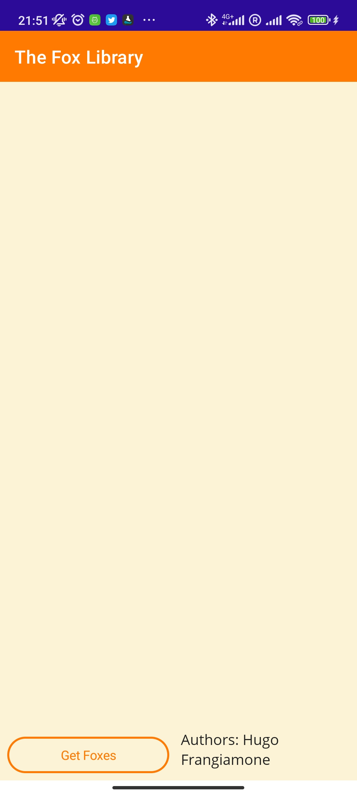
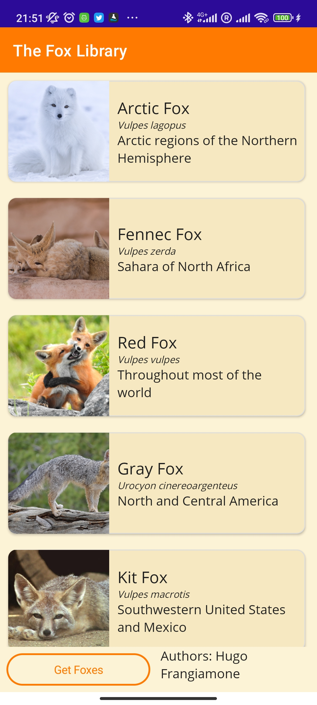
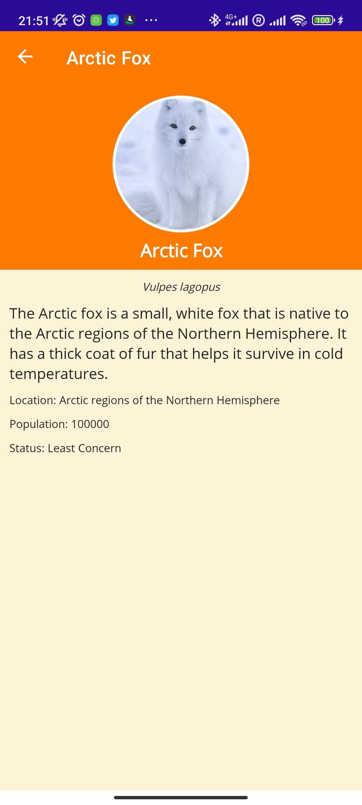
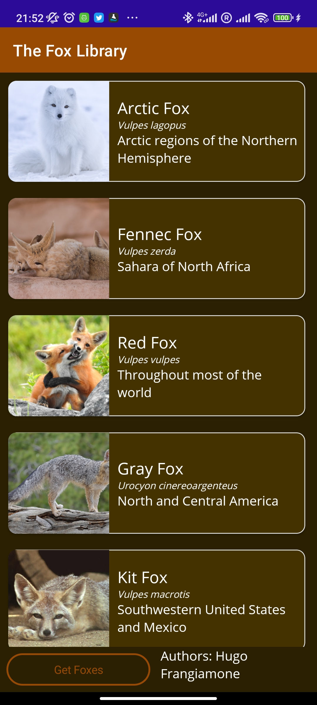
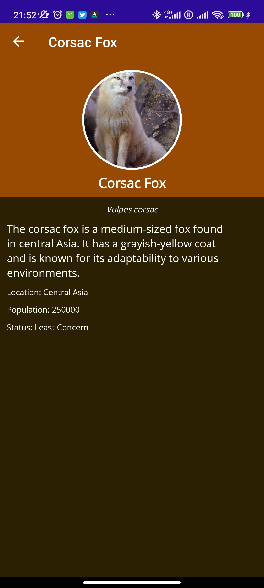

### Hugo Frangiamone - 5999222007
#### 2023-03-21
## Pemrograman Berbasis Kerangka Kerja
# Assignment 4 

## Usage
The application have not been exported yet, so you'll need those installed and working on your computer :
- Visual Studio 2022 w/ MAUI package installed
- Android Emulator or Android Device in order to test the application in its full extent

To run the solution from the root of this repo: 
```bash
cd Finish/
MonkeyFinder.sln
```

## Goals
Recreate the 'MonkeyFinder' Application format with a different dataset. The application have to use the MVVM architecture and handle theme changes.

## Dataset
The dataset used is a hand made dataset of 8 fox species. The dataset is a JSON file with the following structure:
```json
{
    "name": "Arctic Fox",
    "scientificName": "Vulpes lagopus",
    "description": "The Arctic fox is a small, white fox that is native to the Arctic regions of the Northern Hemisphere. It has a thick coat of fur that helps it survive in cold temperatures.",
    "location": "Arctic regions of the Northern Hemisphere",
    "population": 100000,
    "status": "Least Concern",
    "image": "https://upload.wikimedia.org/wikipedia/commons/6/67/Iceland-1979445_%28cropped_2%29.jpg"
},
```

The full dataset can be found [here](Finish/MonkeyFinder/Resources/Raw/foxes.json).

## Main Page 
The main page is a scrollable list of all the fox species. A button is also present for the user to refresh the list (Considering that you could use a REST API). Each species has a 'card' displaying a picture, name (scientific) and the location of the fox. 




## Detail Page
The detail page is a page that shows the details of a specific fox species. The page has a header giving the fox name and a picture of the fox. The page also has a body with the description, location, population and status of the fox.



## Theme changes
We defined a primary color and a secondary color for the application. The primary color is used for the header and the secondary color is used for the body. The theme changes between a light and a dark theme by using the primaryDark and secondaryDark colors instead. You can see the difference between the two themes below.






